# [Git & Markdown](https://classroom.google.com/w/NjE4Nzc4ODM0NjQx/tc/NTg5MjUwNTQwNzMw)

## EJERCICIO 1
### 1. Como crear un repositorio
- Primer paso debemos crear un **directorio** con mkdir *(nombre del directorio)*.

- Siguiente paso, accedemos dentro del **directorio** generado con cd *(nombre del directorio)*.

- Una vez dentro para generar un **repositorio local** utilizaremos git init dentro del mismo.

- Para comprobar si el repositorio es correcto escribiremos el comando **git status**.

### 2. Estados de Repositorio 
- Al hacer un git add añadimos los cambios realizados al **staging area**.

- Para comprobar si realmente está con **git status** podemos verlo.

- Seguidamente creamos un snapshot utilizando git commit -m "(*descripción del progreso*)".

- En este momento el repositorio se encuentra en ***Commited***, si añadimos contenido dentro del fichero estará en ***Modified***, si hicieramos un **git add** estaría en ***staging area***.
### 3. Intentar subir ficheros al repostiorio remoto
* Aparece error y nos dice que no encuentra ningún repositorio.

### 3. Sincronizar repositorio local con la nube
1. Primero crear un repositorio en la nube a través de **GIT HUB**.

2. Sincronizar el repositorio local con el de la nube.

1. Y actualizar la rama de la nube con la local. Utilizaremos el **git push origin master** para ello.

2. Comprobar commits en **github**.

## EJERCICIO 2
1. Crea un repositorio llamado repo02 desde GitHub. ¿Sería considerado un repositorio
local o remoto?
És considerado remoto ya que **GitHub** és la nube.

2. Posteriormente, clónalo (mediante al comando git clone), lo que realizará una copia
del repositorio remoto en nuestro equipo, creando con ello un repositorio local a partir del
repositorio en remoto
- Vamos al Escritorio y hacemos un **git clone https://github.com/xavigalan/repo02.git**

3. - Añade un fichero readme.md y ejecuta los comandos pertinentes hasta llegar a poder
realizar un commit.

4. – Entra en este manual de Markdown y haz un resumen de los principales comandos de
Git con los que hemos trabajando. Puedes utilizar tablas, imágenes, títulos, enlaces, etc.
IMPORTANTE no subas todo el código de golpe, ya que es mejor que practiques los
conceptos.Por tanto, ves subiendo los cambios en distintas subidas a tu repositorio de
GitHub y comprobando que los cambios se visualicen correctamente.
## [RESUMEN MARDOWN](https://medium.com/@davidbernalgonzalez/3-markdown-c82d88c1d222)
### Puntos importantes MARKDOWN
- Encabezados tenemos de **h1** hasta **h6** utilizando la # a principio de la línea.
- Comentarios no apareceran en el markdown pero si en el fichero, para añadirlos hay varias formas pero por ejemplo <!-- HOLA ESTO ES UN COMENTARIO --> <!- - > son 2 guiones juntos al principio.
  * Listas para añadir listas a principio de cada frase con lo siguientes signos - * +, son distintos para poder separar las líneas e incluso sublistas.
- Enlaces/Links [BUENOS DÍAS](https://www.bing.com/ck/a?!&&p=91e193f8d3157c08JmltdHM9MTcyNTQwODAwMCZpZ3VpZD0xZDMyZTM1NC1jMWNkLTZkYTgtMzdiYy1mMDljYzBjYjZjNmMmaW5zaWQ9NTUxNw&ptn=3&ver=2&hsh=3&fclid=1d32e354-c1cd-6da8-37bc-f09cc0cb6c6c&u=a1L2ltYWdlcy9zZWFyY2g_cT1idWVub3MrZCVjMyVhZGFzJmlkPUY2RTZDMDExNzRFMzE1NjQ0RTk4MDk0MzFCQzBCMDQ4RDg1Q0YzRDgmRk9STT1JUUZSQkE&ntb=1) con [] es el texto a mostrar y seguido de esto () el enlace del texto.
- Separador de líneas con los siguientes signos *- en la parte inferior de la línea que separamos.

**PROBANDO **
***
**SEPARADOR**
* * *
- **IMÁGENES** para añadir imágenes sin enlace ![]  y si despues de ![] añadimos parentesis si veremos la imágen.

- **IMÁGENES** para añadir imágenes con enlace igual que la anterior pero añadiendo 
- **Tablas**
Así se veria para añadir la siguiente tabla.
| Header | Column 1 | Column 2 | Column 3 |
| :----- | :------- | :------: | -------: |
| 1. Row | is       |    is    |       is |
| 2. Row | left     |  nicely  |    right |
| 3. Row | aligned  | centered |  aligned |

| Header | Column 1 | Column 2 | Column 3 |
| :----- | :------- | :------: | -------: |
| 1. Row | is       |    is    |       is |
| 2. Row | left     |  nicely  |    right |
| 3. Row | aligned  | centered |  aligned |

## EJERCICIO 4 FAST FORWARD

1. Crea un directorio llamado repo04
- He utilizado el metodo remoto,es decir creando el **repo04** a través del github y ejecutando un ***git clone*** (*idrepositorio*).
  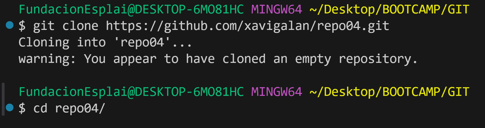

2. Añade un fichero readme.md vacío al repositorio local

3. Crea una rama con tu nombre y la fecha actual

4. Desde tu rama (**xavi06092024**) edita el fichero readme.md

5. Haz 3 commits desde nuestra rama (**xavi06092024**)
6. En el siguiente orden realiza lo siguiente:
   - 4.6.1 – Fusiona tu rama con master 

    - 4.6.1 – Fusiona tu rama con master 

1. Elimina solamente la rama en local david02032022 ya que si eliminásemos la remota no veríamos la
rama en remoto.

1. Visualiza el resultado tanto mediante el comando git log --all --oneline -decorate –graph, como
desde el pluging de VSC

## EJERCICIO 5 NO FAST FORWARD
1. Crea un directorio llamado repo05,
- He utilizado el metodo remoto,es decir creando el **repo05** a través del github y ejecutando un ***git clone*** (*idrepositorio*).

2. Crear fichero readme
  - He creado el fichero readme

3. Crea el fichero readme.md
□ 5.3 - Crea una rama con tu nombre y la fecha actual (por ejemplo en mi caso la rama
□ se llamará ***xavi09062024***) y sitúate en dicha rama

4. Haz 3 commits en la rama (david02032022)
   
   
5. En este caso, antes de hacer el merge sube ambas ramas al repositorio remoto. Verifica que se
hayan subido correctamente. Lo hacemos así, ya que cuando realicemos el merge si nos equivocas
podemos volver a clonar el repositorio sin necesidad de tener que volver a comenzar el ejercicio de 0.
* Los pushs de cada rama

6. Basándote en el ejemplo que hemos visto anteriormente, realiza un commit no fast-forward en el
que mergearemos la rama ***xavi06092024*** con master.
* Primeramente hacemos un **pull** de ***xavi06092024*** a ***main***, una vez hecho un ejecutamos el **merge** para juntar las brancas y finalmente un push. 

7. Visualiza el resultado tanto mediante el comando git log --all --oneline --decorate --graph, como
desde el pluging de VSC

8. Explica las diferencias entre un merge FF y un merge no FF
* Al hacer un merge Fast Fosward directamente traspasamos los commits de la rama ***xavi06092024*** a la ***main***, a diferencia del No Fast Fosward continuamos manteniendo ambas ramas con sus commits tanto como la ***xavi06092024*** como la ***main*** podiendo tener un mejor historial de datos.  
## EJERCICIO 6 GIT
1. Haz un alias con la finalidad de que cuando escribamos el comando git log adog nos ejecute lo
siguiente:
* Vamos al directorio de nuestro usuario, accedemos al archivo .gitconfig y añadimos
* [alias] 
  * adog = log --all --decorate --oneline --graph
---

* y el otro metodo que podemos utilizar 

  ***git config --global alias.adog "log --all --decorate --oneline --graph"***
## Ejercicio de Git bash
1. [Clona el repositorio](https://github.com/DavidBernalGonzalez/practicaGit.git)
* Con esto clonamos tu repositorio.

2. Visualiza las distintas ramas que hay en el repositorio.

3. Dentro del repositorio hay una carpeta llamada practica01, la encontrarás en la rama “practica01”. Sitúate en rama "practica01" para ver la carpeta practica01.
* En la imágen podemos observar en la parte izquierda la carpeta, para cambiar de branch git checkout practica01.

4. Sitúate en el directorio practica1 y edita los archivos a tu gusto. Una vez editados los ficheros, haz un git status para ver que ha pasado con los ficheros. Finalmente, haz un commit para subir los cambios al repositorio local
* He generado cambios dentro de los archivos y commiteado.

5. Crea una rama nueva, llámala practica1_GALANPEREZ_XAVI

6. Muévete a la rama que has creado (practica1_GALANPEREZ_XAVI)

7. En el directorio raíz, crea el fichero practica1_APELLIDOS_NOMBRE.txt y cualquier cosa en su interior. Y haz un commit de los cambios.

8. ¡Nos hemos equivocado! Queremos que en el interior del fichero practica1_APELLIDOS_NOMBRE.txt tendremos que poner nuestro nombre y apellidos. Vuelve a hacer otro commit revirtiendo los cambios (haciendo un nuevo commit) y sube los cambios al repositorio remoto ¿Qué está pasando? ¿Cómo lo solucionarias? ¿Tienes los permisos para escribir en dicho repositorio? ¿Existe posibilidad de arreglarlo? TIP: Elimina el remote actual y añade el de un remote de un repositorio nuevo en tu cuenta ya así si que tendrás permisos para escribirlo
* Tenemos el commit y seguidamente el push, pero nos salta un error porque no tenemos permisos del propietario del repositorio remoto para poder hacer cambios en el.

* Si ejecutamos el comando git remote -v podemos ver quien es el propietario y debemos eliminar el remote actual.
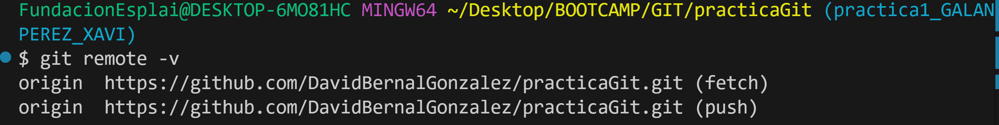
* Aqui podemos comprobar que ya no hay remote

* Después para añadir un nuevo remote tenemos que crear un repositorio remoto nuevo a través del github y escribir git remote add origin **(Nombre del remoto)**, ya tenemos permisos para subir archivos.

* Push

9. Vuelve a la rama “practica1”.

10. Haz un merge de tu rama (practica1_GALANPEREZ_XAVI) con practica1

11. Añade dentro de la rama de tu carpeta todas los comandos que has utilizado. Puedes crear un documento por ejemplo de Word.
  
* git clone "remote"
* git branch
* git checkout "nombre rama"
* git status
* git add .
* git commit -m "" - git commit -am ""
* git branch "nuevarama"
* git remote -v
* git remote remove origin
* git remote add "nombre del remote"
* git push origin "nombre rama"
* git merge "nombre de la branca"
## Ejercicios de resolución de conflictos
1. Crea un repositorio llamado conflictos-git y añade un readme.md (puedes marcar la pestaña add readme.md cuando lo creas desde GitHub)
* Generado a través de **GitHub**.
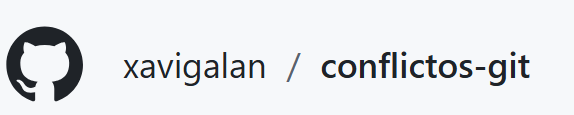
* Para crear el readme.md a través del **GitHub** 
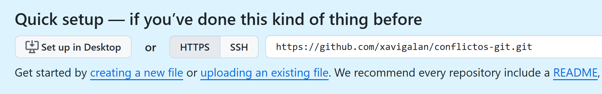
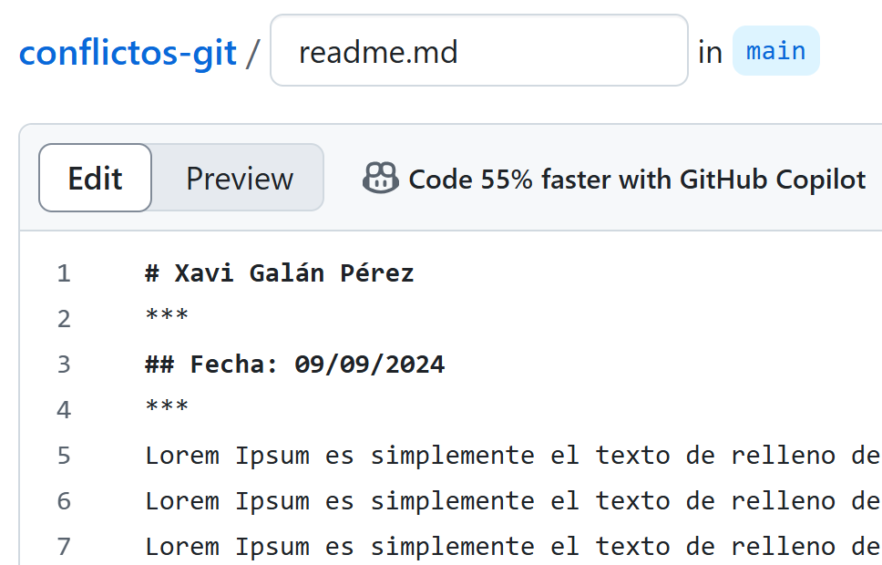
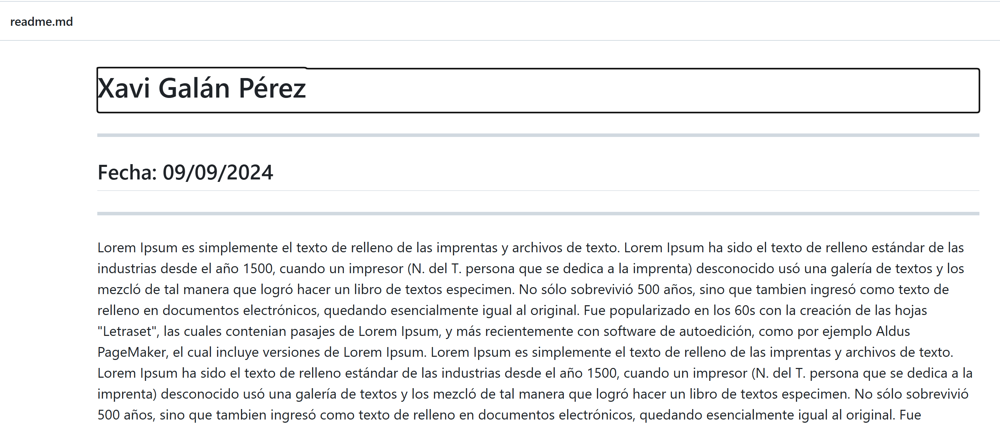
3. Clona el repositorio remoto conflictos-git a tu dispositivo (git clone).
* De esta manera lo clonamos
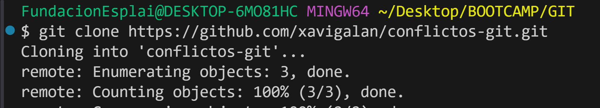
* Podemos observar que tenemos los cambios bajados del repositorio de **GitHub**.
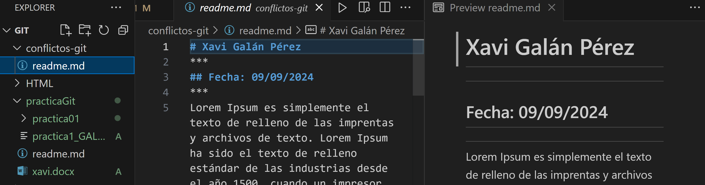
4. Modifica desde GitHub, el repositorio poniendo tu nombre y la fecha de hoy en lugar del actual.
* La modificación que voy a hacer.
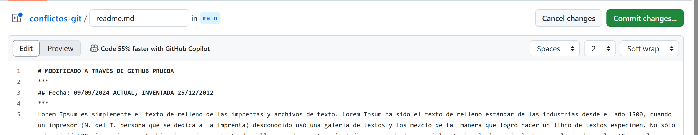
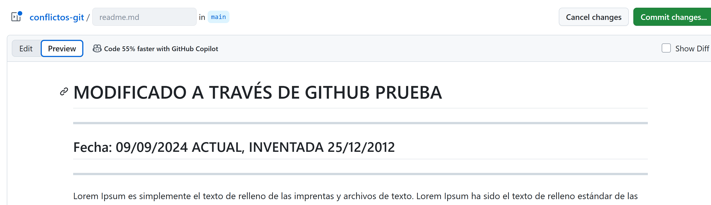
* Aqui muestro los commits
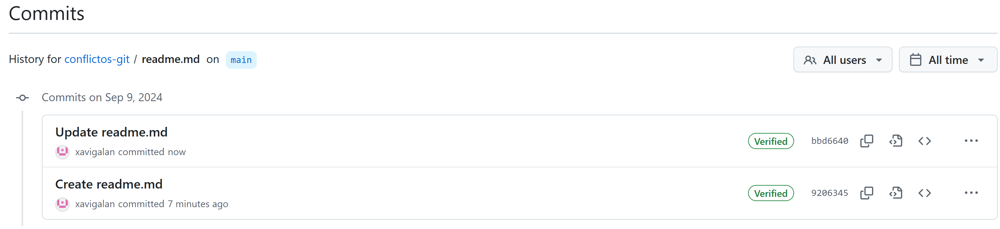
5. Ves al repositorio local y modifica el nombre por Jaimito Fernández y pon como fecha 22/22/2222
* El readme.md en el dispositivo local

* Los siguientes cambios:
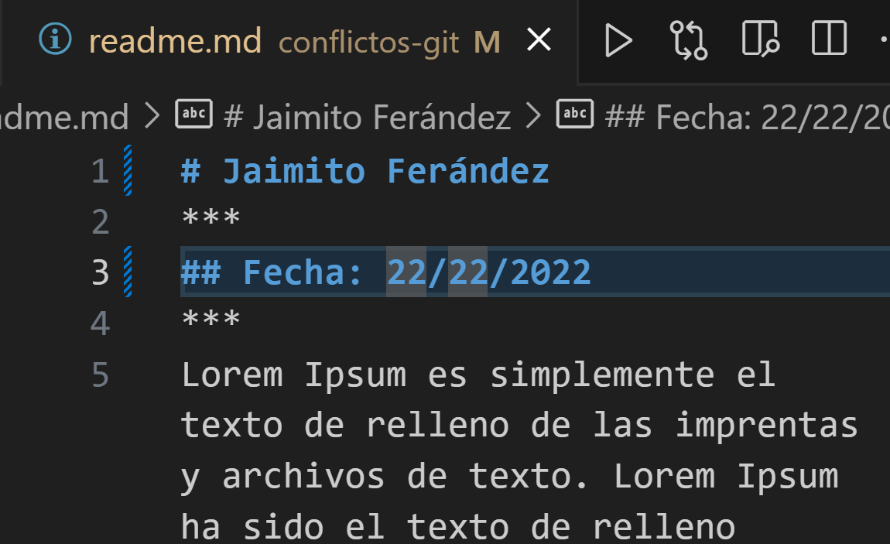
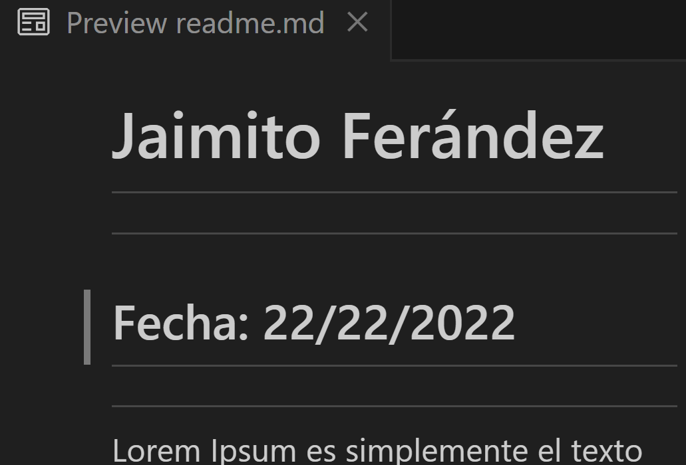
6. Intenta hacer un push al repositorio remoto.

Haciendo git add .
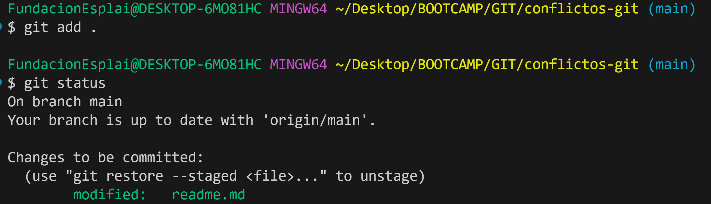
Commit
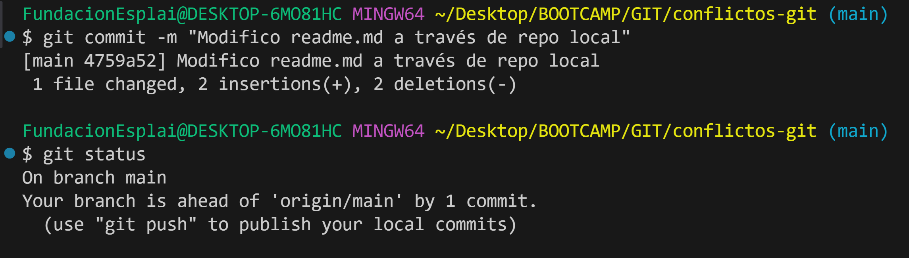
7. Haz un git pull y ves que Git no puede auto-resolver el conflicto. Por lo que nos deja la responsabilidad a nosotros como programadores:

* Nos aparece los dos commits ya que tenemos diferentes archivos, con esto me refiero al interior del fichero del repositorio local pone algo distinto al repositorio remoto (**GitHub**) y debemos elegir con cual queremos quedarnos.
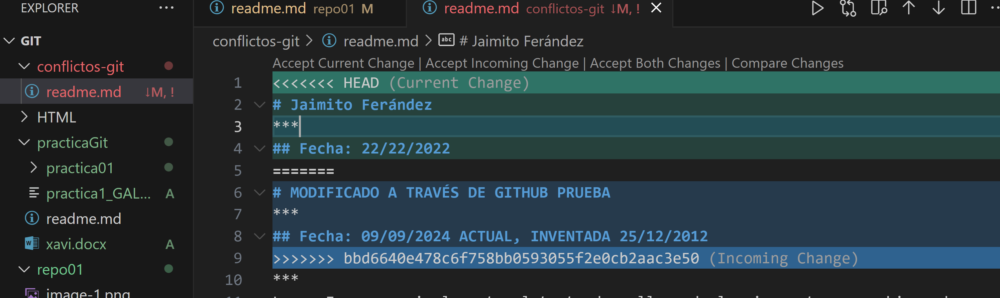
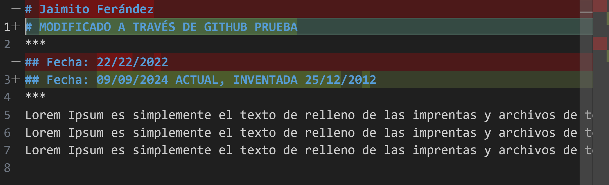
git diff
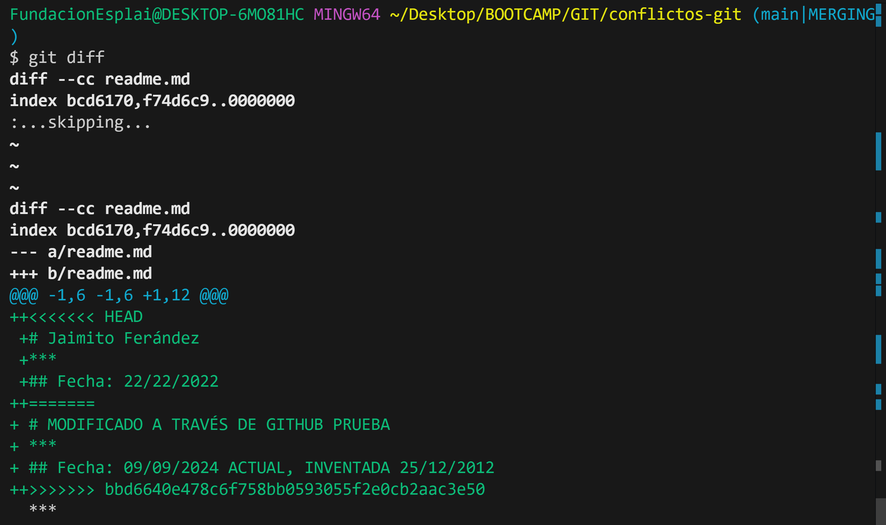
8. Piensa en que versión quieres, es muy importante estar seguro de lo que
queremos hacer para no tener dolores de cabeza y no darle a cualquier opción
sin pensarlo. ¿Qué versión quiero? ¿Con que cambios me quiero quedar? Y
finalmente, soluciona el conflicto
* Elijo la versión incoming que es la del GitHub.
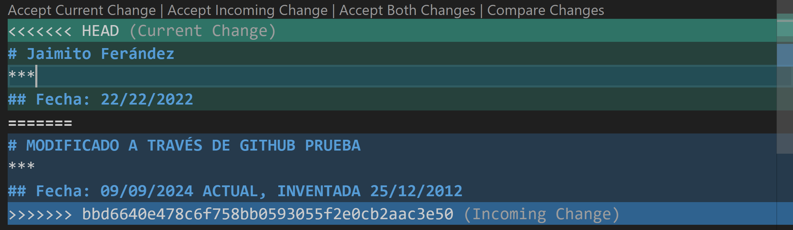
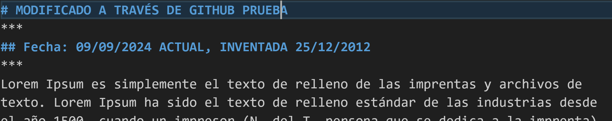
## Ejercicios de resolución de conflictos Parte 2
1. Basándote en el ejercicio anterior crea otro fichero (puedes utilizar el mismo) y
tal y como hemos en el ejemplo anterior vamos a tener conflictos pero esta vez
muchos más.
* He generado un archivo de texto llamado conflicto.txt
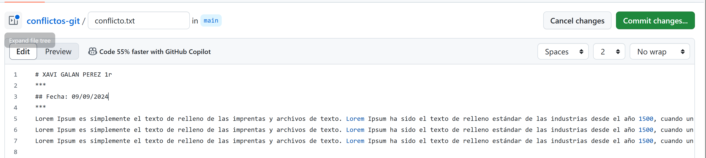
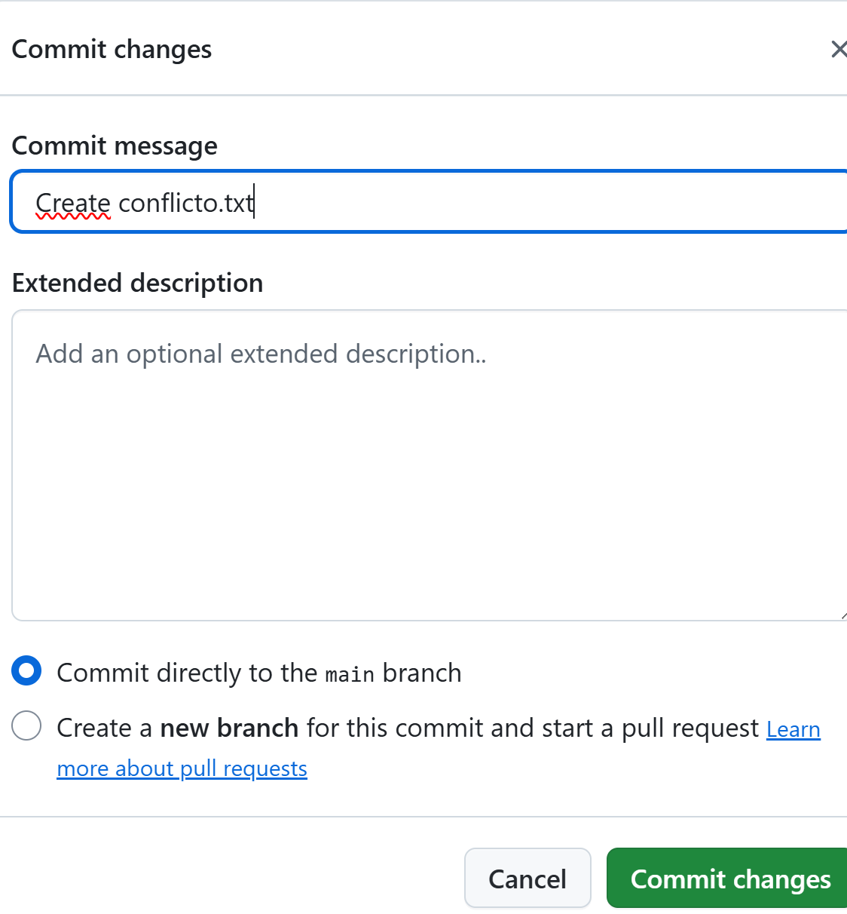
* Por ejemplo:
  * En el repositorio remoto, puedes cambiar todas las letras a por una @.
  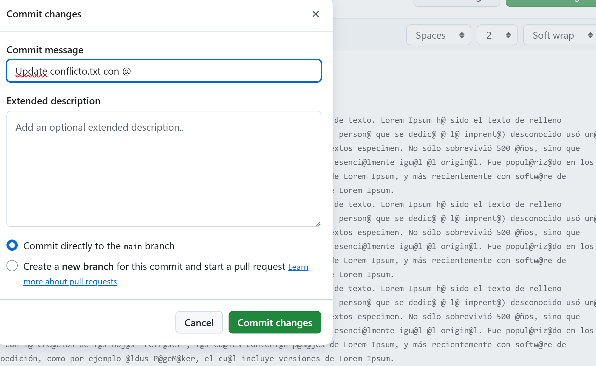
  * En el repositorio local, puedes cambiar todas las letras e por €.
  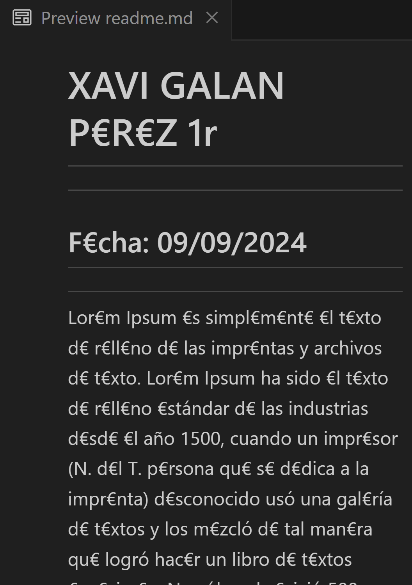
Haz que se generen conflictos compáralos analiza que es lo que quieres. En muchas ocasiones necesitaras incluso sentarte con otro compañero para ver conflicto a conflicto que dejáis,etc.
* Pues al hacer un pull del remoto al local tenemos diferente contenido dentro del archivo nos aparece esto.
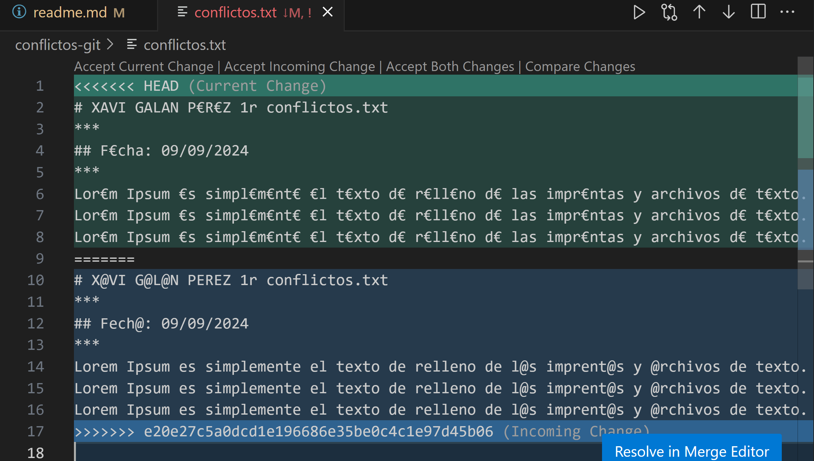
* Yo en mi caso escogeré las 2 juntas que es **Accept Incoming Change**, que son las @.
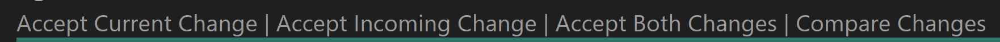
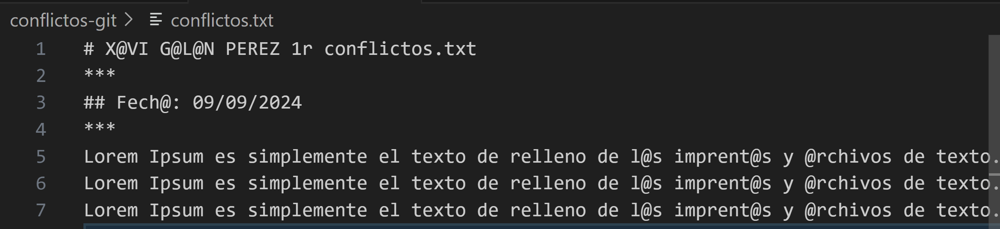
